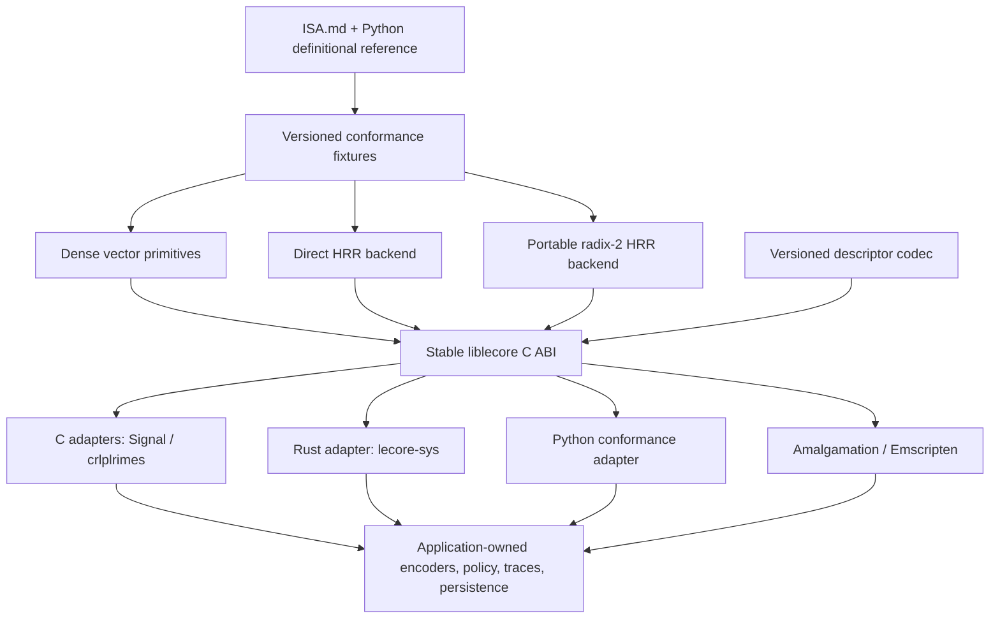

# liblecore — Engineering Plan

*Status: proposed · Technical architecture, compatibility policy, delivery plan, and dependency-ordered backlog.*

---

## 1. Purpose and authority

This document turns the product requirements in [`PRD.md`](PRD.md) into an implementable native-library plan.

The authority order is deliberate:

1. [`docs/ISA.md`](docs/ISA.md) defines observable architecture.
2. [`holographic/misc/holographic_reference.py`](holographic/misc/holographic_reference.py) is the definitional
   executable reference.
3. [`tests/test_isa_conformance.py`](tests/test_isa_conformance.py) demonstrates how continuous values and exact
   decisions are judged separately.
4. Versioned liblecore fixtures make that contract portable outside Python.
5. C backends implement the contract and may be replaced when a new implementation passes the same gates.
6. Consumer adapters preserve application-specific encoders, trace policies, legal-action rules, and persistence.

Existing native implementations are behavioral oracles and workload sources. liblecore itself is a clean C11
implementation derived from leCore's MIT-licensed specification and reference. Code from AGPL or repositories with
unclear license provenance is not copied into the canonical library without an explicit compatible grant.

## 2. Engineering goals

- Expose the frozen caller-supplied-vector HRR algebra subset through a stable, language-neutral C ABI;
  `random_vector` and atom generation remain explicitly outside version 1.
- Preserve raw leCore semantics, including unnormalized bind and unbind.
- Make f64 and f32 distinct profiles with distinct conformance manifests.
- Support every positive `uint32_t` dimension that passes checked size/allocation limits through a direct backend,
  and accelerate power-of-two dimensions with a portable radix-2 backend.
- Allocate all plans and scratch at context creation; allocate nothing in documented hot-path operations.
- Keep opaque implementation state behind caller-owned vector buffers and typed operations.
- Build reproducibly as static, shared, object, installed, vendored, Cargo, and Emscripten forms.
- Prove continuous-value conformance and exact decision agreement against the Python authority.
- Migrate existing consumers through feature flags, shadow execution, and replay evidence.
- Make failures, backend choice, feature support, and compatibility inspectable.

## 3. Non-goals of ABI version 1

ABI v1 does not contain:

- `UnifiedMind` or any high-level leCore subsystem;
- seeded atom generation;
- application encoders or vocabularies;
- a prescribed associative-memory update policy;
- application persistence, database, filesystem, network, or process APIs;
- generated scalar/SDF kernel execution;
- MAP/Hadamard binding, integer outer-product memory, or freestanding targets;
- compiler-specific vector types, public complex-number types, or exposed FFT layouts; or
- automatic online performance calibration.

These boundaries are part of stability. An extension is not admitted by placing a function in the same header; it
must receive a named semantic profile, fixtures, a consumer, and a measured reason to exist.

## 4. Architecture



### 4.1 Layers

**Base vector layer.** The caller-supplied-vector ISA operations plus normalization, dot, batch scoring, and
validated-buffer utilities. The utilities are public only with their own specified fixtures; they are not silently
promoted to frozen ISA instructions. This layer owns no domain vocabulary.

**HRR layer.** Raw circular convolution and involution-based unbinding, implemented by interchangeable direct and
FFT backends.

**Descriptor layer.** Encodes and validates compatibility metadata and payload framing. It owns bytes, not files.

**Bindings.** Thin Python and Rust adapters that validate language-level buffers and lifetimes without defining new
math.

**Consumer adapters.** Live in consumer repositories. They own normalization composition, atom streams, feature
encoding, memory update rules, action legality, rollout policy, storage, and migrations.

### 4.2 Proposed repository layout

```text
native/liblecore/
  VERSION
  ISA_VERSION
  CMakeLists.txt
  include/lecore/lecore.h
  include/lecore/lecore_format.h
  src/
    context.c
    status.c
    vector_f32.c
    vector_f64.c
    cleanup_f32.c
    cleanup_f64.c
    hrr_direct_f32.c
    hrr_direct_f64.c
    hrr_radix2_f32.c
    hrr_radix2_f64.c
    format.c
    crc64.c
    internal/
  tests/
    c/
    consumers/
  cmake/lecoreConfig.cmake.in
  pkgconfig/liblecore.pc.in
  amalgamation/
bindings/
  python/lecore_native.py
  rust/lecore-sys/
tests/native/
  fixtures/
  test_liblecore_conformance.py
benchmarks/
  bench_liblecore.py
tools/
  generate_liblecore_fixtures.py
  generate_liblecore_amalgamation.py
```

Generated amalgamation and fixture files are reproducible outputs. CI regenerates them and fails on drift.

## 5. Public ABI design

The installed public headers are `<lecore/lecore.h>` and, when interchange is enabled,
`<lecore/lecore_format.h>`. All symbols use the `lecore_` prefix. The CMake import is `lecore::lecore`; the
product and `pkg-config` package are named `liblecore`, while the linker output basename is `lecore`, producing
`liblecore.a`, `liblecore.so`, or `liblecore.dylib` and the conventional linker spelling `-llecore`.

The following is the proposed stable ABI shape, not yet the frozen header. Preview `0.x` artifacts report ABI `0`,
may break between preview releases, and do not ship `*_v1` symbols as stable. ABI `1` and the prospective names below
are reserved until release milestone `LC-037` freezes them.

```c
#define LECORE_ABI_VERSION UINT32_C(1) /* reserved for the LC-037 stable ABI */

typedef uint32_t lecore_status;
#define LECORE_OK             UINT32_C(0)
#define LECORE_EINVAL         UINT32_C(1)
#define LECORE_EDIM           UINT32_C(2)
#define LECORE_EPROFILE       UINT32_C(3)
#define LECORE_EBACKEND       UINT32_C(4)
#define LECORE_EOVERFLOW      UINT32_C(5)
#define LECORE_ENOMEM         UINT32_C(6)
#define LECORE_EUNSUPPORTED   UINT32_C(7)
#define LECORE_ENONFINITE     UINT32_C(8)
#define LECORE_EFORMAT        UINT32_C(9)
#define LECORE_ECHECKSUM      UINT32_C(10)

typedef uint32_t lecore_profile;
#define LECORE_PROFILE_HRR_F64_V1 UINT32_C(0x00010001)
#define LECORE_PROFILE_HRR_F32_V1 UINT32_C(0x00010002)

typedef uint32_t lecore_backend;
#define LECORE_BACKEND_AUTO   UINT32_C(0)
#define LECORE_BACKEND_DIRECT UINT32_C(1)
#define LECORE_BACKEND_RADIX2 UINT32_C(2)

typedef uint32_t lecore_validation;
#define LECORE_VALIDATION_SHAPE  UINT32_C(0)
#define LECORE_VALIDATION_FINITE UINT32_C(1)

typedef struct lecore_allocator_v1 {
    uint32_t struct_size;
    void *user;
    void *(LECORE_CALL *allocate)(void *user, size_t bytes, size_t alignment);
    void (LECORE_CALL *deallocate)(void *user, void *pointer, size_t bytes, size_t alignment);
} lecore_allocator_v1;

typedef struct lecore_config_v1 {
    uint32_t struct_size;
    uint32_t abi_version;
    uint32_t profile;
    uint32_t backend;
    uint32_t validation;
    uint32_t flags;
    uint32_t dimension;
    lecore_allocator_v1 allocator;
    uint64_t reserved[4];
} lecore_config_v1;

typedef struct lecore_context lecore_context;
```

`LECORE_API` controls export visibility, `LECORE_CALL` fixes the supported platform calling convention for public
functions and callbacks, and all declarations are enclosed by C++ `extern "C"` guards. ABI-facing
status/profile/backend/validation values are fixed-width integers, not C enums, so compiler enum-size options cannot
change the calling convention.

Profiles are composite, immutable semantic identities: `HRR_F64_V1` fixes HRR algebra, f64 storage, observable
decision/reduction order, and edge behavior; `HRR_F32_V1` does the same for f32. Internal reduction structure for a
TOL operation remains backend microarchitecture. Scalar type is therefore queryable but cannot conflict with the
selected profile.

`native/liblecore/ISA_VERSION` is the dedicated source of truth returned by `lecore_isa_version()`. It versions the
declared caller-supplied-vector subset of [`docs/ISA.md`](docs/ISA.md) and advances only when that subset's observable
semantics change. Python `CORE_VERSION`, Python package semver, native package semver, ABI, and format versions do not
advance it automatically.

Public structures begin with `struct_size`, reserve zeroed expansion space, and are initialized by library helpers.
Numeric constants are append-only. Unknown fields are ignored only when the receiving ABI explicitly permits the
larger structure; unknown major ABI versions fail closed.

### 5.1 Lifecycle and introspection

```c
LECORE_API uint32_t LECORE_CALL lecore_abi_version(void);
LECORE_API uint32_t LECORE_CALL lecore_isa_version(void);
LECORE_API const char *LECORE_CALL lecore_version_string(void);
LECORE_API uint64_t LECORE_CALL lecore_capabilities(void);
LECORE_API const char *LECORE_CALL lecore_status_string(lecore_status status);

LECORE_API void LECORE_CALL lecore_config_init_v1(lecore_config_v1 *config);
LECORE_API lecore_status LECORE_CALL lecore_context_create(
    const lecore_config_v1 *config,
    lecore_context **out_context);
LECORE_API void LECORE_CALL lecore_context_destroy(lecore_context *context);

LECORE_API uint32_t LECORE_CALL lecore_context_dimension(const lecore_context *context);
LECORE_API lecore_profile LECORE_CALL lecore_context_profile(const lecore_context *context);
LECORE_API lecore_backend LECORE_CALL lecore_context_backend(const lecore_context *context);
LECORE_API lecore_validation LECORE_CALL lecore_context_validation(const lecore_context *context);
LECORE_API size_t LECORE_CALL lecore_context_scratch_bytes(const lecore_context *context);
```

Allocator callbacks are supplied as a pair or not at all. Requests are nonzero and use a power-of-two alignment at
least `alignof(max_align_t)`; a `NULL` result maps to `LECORE_ENOMEM`. Every successful allocation is returned to the
matching callback with the original byte and alignment values. `lecore_context_create` sets `*out_context = NULL`
on every failure, rejects nonzero reserved fields and unknown flags, and exposes no partially built context.

The eventual `lecore_config_init_v1` zeroes the full known structure, sets its size and ABI version, selects
`HRR_F64_V1`, `AUTO`, and `SHAPE`, and leaves dimension `0` so the caller must provide it explicitly. Preview
initializers use their preview-version name and ABI value.

If no allocator is supplied, hosted builds use the library's documented default allocator. All allocations occur
during context creation. A later freestanding profile may require caller-provided storage, but that does not need to
complicate the hosted ABI before a consumer exists.

### 5.2 Typed operation families

The operation families have parallel f64 and f32 symbols. They do not accept `void *` element buffers or silently
convert precision.

```text
lecore_normalize_f64 / lecore_normalize_f32
lecore_dot_f64 / lecore_dot_f32
lecore_dot_many_f64 / lecore_dot_many_f32
lecore_cosine_f64 / lecore_cosine_f32
lecore_cosine_many_f64 / lecore_cosine_many_f32
lecore_hrr_bind_f64 / lecore_hrr_bind_f32
lecore_hrr_unbind_f64 / lecore_hrr_unbind_f32
lecore_involution_f64 / lecore_involution_f32
lecore_permute_f64 / lecore_permute_f32
lecore_bundle_f64 / lecore_bundle_f32
lecore_cleanup_f64 / lecore_cleanup_f32
lecore_hrr_bind_batch_f64 / lecore_hrr_bind_batch_f32
lecore_hrr_bind_fixed_f64 / lecore_hrr_bind_fixed_f32
lecore_hrr_unbind_all_f64 / lecore_hrr_unbind_all_f32
lecore_cosine_many_f64_f32
```

Scalar outputs such as cosine and cleanup score are written through output pointers so every operation can return a
status consistently.

### 5.3 Calling rules

- Context dimension is immutable and in `1..UINT32_MAX`; construction still fails when checked workspace or byte
  arithmetic exceeds `size_t` or available memory. Counts and strides use `size_t`.
- An f64 function rejects an f32 context and vice versa.
- Row strides are expressed in elements, never bytes.
- A documented operation may permit output to exactly alias one complete input. Partial overlap is unsupported.
- Batch input and output regions are disjoint in ABI v1 unless the operation explicitly states otherwise.
- `dot` reduces components in ascending index order; cosine uses that reduction, and codebook scoring visits rows
  in ascending stable-index order.
- `bundle` rejects an empty input; its internal summation order is free within value and downstream-decision gates.
- `cleanup` scans candidates in ascending index order and selects the lowest index on an exact tie.
- `AUTO` backend selection is deterministic from versioned rules, configuration, dimension, and compiled
  capabilities. It does not benchmark during a call.
- A forced unsupported backend returns `LECORE_EUNSUPPORTED`; it never substitutes another backend silently.
- No operation prints, aborts, writes global error state, changes the floating-point environment, opens resources,
  or allocates after context creation.
- The library has hidden default symbol visibility; only `LECORE_API` declarations are exported.
- ABI-breaking changes require a new ABI major and shared-library SONAME.

### 5.4 Validation model

Shape, null, overflow, profile, and backend checks are always enabled. Raw arithmetic must preserve the ISA's frozen
non-finite behavior: NaN propagates through bind, unbind, and bundle; cosine propagates it unless the other operand's
norm is exactly zero, because the pinned zero-norm branch takes precedence and returns `+0.0`. Cleanup follows NumPy
argmax behavior, including selecting the first NaN score. Element-wise finite validation is therefore an explicit
boundary layer:

- `LECORE_VALIDATION_FINITE` scans inputs and returns `LECORE_ENONFINITE` before computing.
- `LECORE_VALIDATION_SHAPE` performs raw ISA arithmetic without an extra scan.
- Standalone `lecore_validate_f32` and `lecore_validate_f64` helpers let adapters validate once at ingestion.

The initializer defaults to `LECORE_VALIDATION_SHAPE` so the numeric API itself remains ISA-conformant. For finite
inputs, `FINITE` produces the same profile values; for non-finite input it deliberately returns `LECORE_ENONFINITE`
before arithmetic. External-data adapters must choose `FINITE` or call a standalone validator before entering raw
operations. Conformance fixtures pin NaN/Inf propagation and cleanup decisions in raw mode as well as rejection in
checked mode. The chosen boundary mode remains queryable from the context.

## 6. Semantic profiles

The f64 caller-supplied-vector ISA subset retains the authority's existing value rule on its declared corpus:
`max_abs(candidate-reference) <= 1e-9` with no relative-error substitution. Task `LC-003` records that corpus's
dimension, magnitude, norm, and conditioning domain; it may add wider-magnitude stress reports, but those are
supplemental and cannot widen the frozen gate. A broader f64 contract requires a new immutable profile or ISA-subset
revision. Supporting utilities introduced by liblecore publish their own domains and abs/rel metrics. The f32 profile
also receives a separate manifest rather than inheriting or weakening f64. Exact reindexes, zero/non-finite edges,
and decisions are checked separately and are never excused by numeric tolerance.

### 6.1 `HRR_F64_V1`

| Operation | Required semantics | Class |
|---|---|---|
| Bind | `out[n] = sum_k a[k] * b[(n-k) mod D]`; no post-normalization | TOL, max absolute error `1e-9` on declared ISA corpus |
| Involution | `out[0] = a[0]`, `out[i] = a[D-i]` | EXACT |
| Unbind | Bind composite with key involution; no post-normalization | TOL |
| Bundle | Sum all rows then normalize; zero sum returns the zero vector | TOL with exact zero edge |
| Normalize | Divide by L2 norm; zero input returns the zero vector | TOL with exact zero edge |
| Dot | Ascending-index f64 multiply/accumulate with f64 output | TOL, per conformance manifest |
| Dot-many | Apply scalar dot to rows in ascending stable-index order; each output matches scalar semantics | TOL values; exact decision corpus |
| Cosine | Dot divided by both norms; either exact zero norm returns `+0.0` before other non-finite handling | TOL with exact zero/NaN precedence |
| Permute | NumPy `roll` convention, shift modulo dimension | EXACT |
| Cleanup | Highest cosine; exact tie selects lowest candidate index | EXACT decision |

Continuous output bits are not frozen where the ISA declares tolerance. Observable decisions and reindexes are.

### 6.2 `HRR_F32_V1`

The f32 profile has the same mathematical operations and edges but a separate reference fixture set, input domain,
and absolute/relative thresholds. `1e-5` on the initial unit-domain corpus is a hypothesis, not a frozen promise;
the final bounds are established from the Signal replay corpus and adversarial fixtures before the profile becomes
stable. Its dot/cosine family multiplies, accumulates in ascending index order, and returns f32.

`lecore_cosine_many_f64_f32` is the separately named NoSQLite utility defined by `LC-029`: it takes one f64 query,
row-major f32 corpus data, and f64 score output. Each f32 component converts exactly to f64; query norm-square, row
norm-square, and dot accumulate in ascending component order using f64. Either zero norm yields `+0.0`; raw
non-finite behavior follows the ISA boundary rule. Rows are emitted in stable ascending order, while document-ID tie
ordering remains host-owned. This operation is not an implicit widening of `HRR_F32_V1`.

The f32 profile is not described as bit-identical to f64, and a near-tie that cannot preserve a required decision is
a failed backend/adoption result—not something hidden by widening the value tolerance.

### 6.3 Floating-point build contract

Reproducible builds prohibit unsafe reassociation and implicit contraction changes. Where supported, CI uses
`-fno-fast-math` and `-ffp-contract=off` or platform equivalents. The supported environment is round-to-nearest;
the library does not change rounding mode.

Decision-producing scans and replay-pinned score reductions use their specified order. Other TOL reductions,
including internal FFT and bundle reductions, remain microarchitecture and may vary within value and exact-decision
gates. A future relaxed decision profile requires a different ID, explicit selection, fixtures, and consumer
evidence.

Tier 1 profiles require `CHAR_BIT == 8`, 32-bit radix-2 `float`, 64-bit radix-2 `double`, and IEC 60559 behavior (or
a configure-time probe proving equivalent NaN/Inf and evaluation semantics). Unsupported representations fail the
build or omit the relevant capability; they never masquerade as `HRR_F32_V1`/`HRR_F64_V1`. The v1 numeric domain
excludes subnormal inputs and cases whose required reference output is a nonzero subnormal. Builds report whether
they preserve or flush subnormals, and a future profile must add explicit fixtures before making them portable.

## 7. Backend design

### 7.1 Direct backend

The direct backend implements circular convolution from its O(D²) definition. It is intentionally simple, supports
every positive `uint32_t` dimension that passes checked resource limits, and is the native correctness oracle. It is
not expected to be the production choice at large dimensions.

Implementation priorities are clarity, overflow-safe indexing, exact loop order, alias safety, and agreement with
the Python reference.

### 7.2 Portable radix-2 backend

The first optimized backend is a dependency-free radix-2 FFT with precomputed bit-reversal and twiddle tables in
the context. It supports power-of-two dimensions and uses preallocated real/complex scratch hidden inside the
implementation.

Requirements:

- raw bind output is not normalized;
- unbind follows the ISA's involution semantics;
- direct-versus-FFT results meet the profile tolerance;
- the committed decision corpus agrees exactly;
- all tails and allowed aliases are tested;
- plan construction reports allocation failure without partial context exposure; and
- the backend publishes scratch use and measured crossover against direct and relevant consumer baselines.

`AUTO` chooses radix-2 for a supported dimension only after the regime has been accepted and encoded as a static,
versioned rule. Otherwise it chooses direct. Platform FFT libraries and SIMD are follow-on backends, not v1
dependencies.

### 7.3 Batch operations

Batch APIs exist only for measured recurring shapes:

- pairwise rows: `bind(A[i], B[i])`;
- one fixed role against many rows;
- one trace unbound against many keys; and
- one query scored against a row-major codebook.

The implementation may reuse spectra and fuse loops, but scalar and batch paths share semantic fixtures. A batch
path that stays within numeric tolerance yet changes a required winner fails decision conformance.

## 8. Context, memory, and threading

`lecore_context` owns configuration, backend plan, twiddle data, scratch, allocator metadata, and counters useful
for tests or diagnostics. It does not own caller vectors, vocabularies, traces, or codebooks.

- A context is single-thread-owned and must not be called concurrently.
- Distinct contexts are independent and may execute concurrently.
- The library contains no process-global mutable state or global last-error buffer.
- Read-only version/status strings have static lifetime.
- Destruction accepts `NULL` and releases exactly what successful creation acquired.
- Context creation validates all size multiplications before allocation.
- Debug allocation instrumentation is compiled into tests, not required in release consumers.

An optional associative-memory layer, if admitted later, uses caller-owned trace buffers and explicitly names its
update policy. Raw additive accumulation and normalize-after-each-write are observably different and cannot share
one implicit `store` contract.

## 9. Interchange descriptor

Opaque contexts are never serialized. The standard v1 distribution must ship and test an optional format component
that can frame vector and trace payloads with a fixed 96-byte little-endian header. Use and linkage are optional:
`LECORE_ENABLE_FORMAT=OFF` may remove the codec from constrained builds, and capability queries report that fact;
the numeric ABI never depends on the codec. Existing application formats may carry the equivalent contract in their
own metadata or a sidecar without rewriting payload bytes. The exact format bytes become immutable when contract
task `LC-007` is accepted; task `LC-016` implements them. Code encodes/decodes fields explicitly rather than
`fwrite()` a C structure.

| Offset | Field | Meaning |
|---:|---|---|
| 0 | `magic[8]` = `LECOREV\0` | Format identity |
| 8 | `u16 format_major` | Breaking format version |
| 10 | `u16 format_minor` | Additive format version |
| 12 | `u16 header_bytes` | Forward-compatible header length |
| 14 | `u16 flags` | Defined format flags only |
| 16 | `u32 artifact_kind` | Vector, matrix/codebook, or trace |
| 20 | `u32 semantic_profile` | For example `HRR_F64_V1` |
| 24 | `u32 scalar_type` | IEEE f32 or f64 |
| 28 | `u32 dimension` | Elements per vector |
| 32 | `u32 normalization_policy` | Raw, unit, or application-declared |
| 36 | `u32 atom_scheme` | `EXTERNAL` in v1 |
| 40 | `u64 seed_namespace` | Application namespace or zero |
| 48 | `u64 vector_count` | Payload rows |
| 56 | `u64 payload_bytes` | Exact byte count following header |
| 64 | `u8 application_contract[16]` | Opaque host contract identifier/digest |
| 80 | `u64 content_crc64_ecma` | Header-with-zeroed-checksum plus payload |
| 88 | `u8 reserved[8]` | Must be zero in v1 |

Payloads use little-endian IEEE-754 bits. The scalar field is required for decoding and must agree with the composite
semantic profile. `application_contract` is a raw 16-byte identifier: all zero means unspecified; any nonzero value
is compared byte-for-byte. Its canonical derivation and domain separation are owned and published by the host. This
lets Signal, for example, bind its encoder, action vocabulary, key generation, and trace-policy versions without
putting those game-specific fields in the generic header. Persisted compatibility follows format and semantic
profiles, not the in-process shared-library ABI.

CRC is CRC-64/ECMA-182: polynomial `0x42F0E1EBA9EA3693`, init `0`, `refin=false`, `refout=false`, xorout `0`, and
check value `0x6C40DF5F0B497347` for `123456789`. It covers exactly `header_bytes` with bytes 80–87 treated as zero,
followed by the declared payload. Decoding rejects nonzero reserved bytes, unknown flags, arithmetic overflow,
payload-size mismatch, `header_bytes < 96`, and buffers whose exact length is not
`header_bytes + payload_bytes`. For dense vector, matrix/codebook, and trace kinds, overflow-checked
`vector_count * dimension * scalar_bytes` must equal `payload_bytes`, and both dimension and vector count are
nonzero. An unknown major version is rejected. A newer minor with the same major is accepted only when the header
length is sane and every set flag is understood. Every future mandatory extension must set a flag, ensuring that an
unaware reader rejects rather than silently ignores it.

The base descriptor codec owns no file handles, migrations, memory maps, compression, or databases. A consumer may
use a stronger external digest or signature; CRC64 detects accidental payload/metadata corruption and is not an
authenticity mechanism.

## 10. Atom generation

ABI v1 accepts caller-provided vectors. It does not claim that a NumPy seed, Signal seed, or `leos-c` seed denotes
the same atom.

`PORTABLE_ATOM_V1` is a separately gated future profile. Before it receives an ID, it must define:

- input byte encoding and Unicode normalization for names;
- domain separation and seed namespace encoding;
- integer hash/PRNG operations and endianness;
- uniform or normal sampling conversion rules;
- unitary-atom construction, if included;
- normalization and zero handling;
- f32/f64 conversion; and
- exact Python, C, Rust, and WASM golden vectors.

Legacy atom streams remain named adapter formats. They are not quietly reclassified as portable.

## 11. Build, package, and release

### 11.1 CMake targets and options

Required consumption modes:

- `add_subdirectory()` from pinned source;
- installed `find_package(lecore CONFIG REQUIRED)` and `lecore::lecore`;
- `pkg-config --cflags --libs liblecore`;
- generated `lecore.c` plus `lecore.h` for Make, Cargo, and Emscripten; and
- direct static or shared linking from a release archive.

Initial CMake options:

```text
LECORE_BUILD_SHARED
LECORE_BUILD_TESTS
LECORE_BUILD_AMALGAMATION
LECORE_ENABLE_F32
LECORE_ENABLE_F64
LECORE_ENABLE_RADIX2
LECORE_ENABLE_FORMAT
LECORE_ENABLE_SANITIZERS
```

Options may remove capabilities from a build but never change an enabled profile's semantics. Capability queries
report what is present.

### 11.2 Amalgamation

The amalgamation is generated from canonical sources, carries license/version data, and exposes the same ABI. CI
regenerates it and fails if the committed output differs. Hand editing an amalgamated file is unsupported.

### 11.3 Versioning

- `native/liblecore/VERSION` owns the native package semantic version independently of the Python `VERSION` file.
- Native `0.x` previews report ABI `0` and may break with explicit release notes; ABI `1` begins only at `LC-037`.
- After ABI `1`, `LECORE_ABI_VERSION` changes only for ABI breaks.
- ISA version, semantic profile IDs, atom scheme, and artifact format version evolve independently.
- Patch releases fix conformant implementation defects without changing ABI or profile meaning.
- Minor releases add symbols, backends, or immutable profiles.
- Major releases may break ABI and change SONAME.
- Release tags use a distinct namespace such as `liblecore-v0.1.0`.

The native release workflow triggers explicitly on `liblecore-v*`; it does not assume the repository's existing
general `v*` Python workflow will recognize or correctly package native tags.

Every release archive contains source, public headers, amalgamation, license notices, changelog, build descriptor,
checksums, and minimal C/C++ examples. Consumers pin the tag/archive and digest. A machine-local installed library
is convenient for development but is not the only CI or deployment path.

### 11.4 Python packaging boundary

The existing `leos-core` wheel remains pure Python and NumPy-backed until a separate product decision changes it.
The native library is optional: absence must not break import, the test suite, or documented NumPy behavior.

Because the current repository automation patch-publishes the Python package after green merges to `main`, native
release automation must not infer its version from those patch bumps. A future optional native wheel is a separate
deliverable with explicit platform and fallback policy.

## 12. Language bindings

### 12.1 Python

The first Python binding is a test and conformance adapter using ctypes. It:

- resolves only an explicitly supplied build or test artifact;
- verifies ABI and semantic profile before use;
- accepts contiguous NumPy arrays with exact dtype and dimension;
- keeps owning Python objects alive across each call;
- converts status codes into typed exceptions; and
- never silently replaces the canonical NumPy implementation.

A production dispatcher is out of scope until native benchmarks show a useful regime and the existing leCore
native-dispatch policy can represent its setup cost and decision gate honestly.

### 12.2 Rust

`lecore-sys` contains generated or hand-audited raw declarations plus a small safe ownership wrapper:

- `Context` owns and destroys one C context;
- `Context` is not `Sync`; `Send` is granted only if ownership transfer is verified safe;
- slices are validated for dtype, dimension, count, and overlap before FFI;
- raw profile and status values remain available for forward compatibility; and
- both vendored `cc::Build` and installed-library modes have consumer tests.

Application crates retain domain state and persistence. No Rust binding mirrors the private C context layout.

### 12.3 WebAssembly

Emscripten compiles the amalgamation with a fixed export list. The WASM test loads fixture bytes, runs operations,
and writes a compact conformance report. The first milestone requires no threads, dynamic loading, filesystem, or
network APIs.

## 13. Testing strategy

### 13.1 Fixture corpus

Fixtures contain explicit IEEE bits and metadata; they are not regenerated from an unspecified RNG during a test.
Dimensions include `1`, `2`, `3`, `7`, `8`, `64`, `384`, `1024`, and `4096` where the operation cost is reasonable.

Required cases:

- convolution identity and shifted impulse;
- bind commutativity;
- unbind recovery and unitary cases supplied by the reference;
- involution self-inverse and permutation round-trip;
- zero normalization, zero-sum bundle, and zero cosine;
- exact finite ties and ascending-index cleanup;
- raw NaN/Inf propagation and first-NaN cleanup, plus checked-boundary rejection;
- combined zero-vector/NaN-vector cosine, pinning the zero branch's precedence;
- profile-representation probes and explicit exclusion-boundary cases for subnormals;
- null, empty, count, stride, dimension, profile, and overflow failures;
- every documented aliasing case and forbidden partial overlap;
- direct fallback on non-power-of-two dimensions;
- FFT versus direct and C versus Python comparisons;
- batch versus scalar value and decision conformance;
- independent contexts running concurrently;
- allocation instrumentation proving zero hot-path allocations; and
- descriptor golden bytes, truncation, unknown major, mismatch, and checksum corruption.

### 13.2 Test classes

**C unit tests.** Lifecycle, statuses, helpers, exact operations, backend internals, allocation, descriptors, and
consumer-header compilation.

**Python differential tests.** In-scope ISA operations run against the existing definitional reference. Task
`LC-008` adds explicit reference helpers and fixtures for public utilities such as normalize, dot, batch scoring,
and cleanup so no API is tested against an accidental production implementation. The report records target,
compiler, backend, profile, input domain, absolute/relative error, and decision agreement.

**Property tests.** Commutativity, self-inverse operations, permutation inverse, scale behavior, zero behavior, and
backend equivalence across generated finite inputs.

**Fuzzing.** Descriptor decoding, configuration, size arithmetic, strides, counts, and public operations with valid
allocated buffers. Fuzzing begins after the ABI shape stabilizes so targets do not become throwaway maintenance.

**Consumer tests.** Build and run from outside the source tree using installed CMake, `pkg-config`, vendored
amalgamation, Cargo, and Emscripten paths.

### 13.3 CI matrix

A dedicated native workflow runs independently from the Python affected-test selector.

| Tier | Lane | Coverage |
|---|---|---|
| 1 | Ubuntu x86_64 GCC | Debug/release, f32/f64, direct/radix-2, C11 and C++17 consumers |
| 1 | Ubuntu x86_64 Clang | Same plus ASan and UBSan |
| 1 | macOS arm64 Clang | Hosted build, installed consumer, profile fixtures |
| 1 | Emscripten | Amalgamated build and fixture self-test |
| 1 | Package | Installed CMake, `pkg-config`, archive checksum, exported-symbol manifest |
| 2 candidate | Windows x86_64 MSVC | Static/shared and C/C++ consumer tests before support is advertised |
| 2 candidate | macOS x86_64 Clang | Hosted and installed-consumer tests before support is advertised |
| 2 candidate | Linux arm64 GCC/Clang | Native or emulated conformance and consumer tests before support is advertised |

Every profile lane runs the scalar-representation and IEC 60559 configure probes before claiming a capability.
Performance timings from noisy hosted runners are recorded artifacts, not merge gates. Semantic and memory-safety
failures are gates.

## 14. Benchmark policy

Benchmarks record:

- profile, backend, compiler, flags, target, and library version;
- dimension, row count, codebook size, and call count;
- context construction and first-call cost;
- steady-state latency and throughput distributions;
- scratch and resident memory;
- artifact/code size; and
- numeric error and exact decision agreement beside timing.

Comparisons include Python/NumPy where relevant, direct C, optimized C, and the consumer's existing implementation.
Results identify their regime; there is no single “C speedup” number. A fast backend that loses in a consumer's
working regime remains disabled there.

`AUTO` rules change only through reviewed benchmark evidence and are versioned/static. They never depend on a noisy
online calibration that could select a different decision path from run to run.

## 15. Consumer migration plans

Implementation work in downstream repositories follows each repository's local contribution rules. For the current
`~/develop` workspace that means an issue, lease, feature branch, and dedicated worktree before edits; canonical
checkouts are not modified in place. These planning documents authorize no cross-repository mutation by themselves.

### 15.1 Signal — first semantic adopter

Signal retains its key generator, pilot encoder, action vocabulary, legality, gossip compatibility checks, routed
memory, and trace update policy.

The adapter exposes three build/runtime modes:

- `legacy`: current implementation only;
- `lecore`: liblecore operations only; and
- `shadow`: both execute, but legacy alone mutates state and selects actions.

Signal's historical normalized bind is reproduced by raw liblecore bind followed by explicit normalize. Its existing
ordered dot scoring over normalized vectors maps to `lecore_dot_f32`; an adapter retains Signal's current non-finite
score-to-zero behavior rather than substituting general cosine semantics. Shadow reports compare vectors, every
action score, winner, top-two margin, route, trace metadata, native replay, and WASM replay. Promotion requires zero
unexplained action or route changes across the committed corpus and a documented performance result. Rollback
remains one build flag until at least one release after promotion.

Signal is AGPL and may consume MIT liblecore. Its implementation is not copied into the MIT library without an
explicit compatible license grant.

### 15.2 NoSQLite — Rust packaging adopter

NoSQLite preserves `holographic-hash-v1`, canonical vector storage, quantization, finite-input checks, routing, and
exact result authority in Rust.

Its first integration may simply compile/link a pinned liblecore and execute ABI/profile smoke tests. A scoring
migration follows only after liblecore has an explicit mixed f64-query/f32-corpus score operation matching
NoSQLite's ordered f64 accumulation. Document-ID tie ordering and exact result authority remain in Rust and are
verified by the host adapter; the query is not downcast merely to fit the first f32 API.

### 15.3 CosyWorld — advisory ranker

CosyWorld continues to obtain legal offers from its authoritative C rules kernel before ranking. liblecore state
lives outside the exported `cw_world` layout. The Rust host may use an optional liblecore ranker over the legal set,
while the existing deterministic heuristic remains fallback and verifier.

With the feature disabled, journals and replays remain byte-identical. liblecore never authorizes a world mutation
or an action absent from the legal offer set.

### 15.4 Zero Grounded Literary LM — WASM and size adopter

Zero LM retains its deterministic text encoder, fixed capacity, partition routing, host-facing `lm_holo_*` ABI,
and recall policy. A compile flag may replace only generic normalization, ordered dot scoring over normalized
vectors, and cleanup; its adapter retains legacy non-finite handling. Native and WASM self-tests must preserve
chosen results and stay within a recorded code-size budget.

Because the repository currently lacks a complete license file, its implementation is not source material for the
canonical library until provenance is resolved.

### 15.5 crlplrimes — dependency cleanup

crlplrimes stops compiling generic HNN source through a sibling Signal path. It may consume the same pinned
liblecore artifact behind an experimental ranking adapter while exact verifiers remain authoritative. Evidence
claims are not promoted merely because the dependency builds.

## 16. Detailed backlog

These are stable planning IDs, not a substitute for an issue tracker. Until an item is accepted into an issue and
assigned, its state is `proposed`; execution status belongs in the owning repository's tracker. Priorities mean:

- **P0:** required for the first stable product;
- **P1:** required for broad, proven adoption but not the initial reference preview;
- **P2:** earned extension, deliberately outside the critical path.

### 16.1 Epic-to-task map

| Product epic | Engineering tasks |
|---|---|
| LC-E0 Contract and governance | LC-001, LC-002, LC-004, LC-006 |
| LC-E1 Reference conformance | LC-003, LC-008, LC-011–LC-015 |
| LC-E2 Portable optimized core | LC-020–LC-023 |
| LC-E3 Distribution and CI | LC-010, LC-017–LC-019, LC-024–LC-028, LC-037–LC-039 |
| LC-E4 Signal shadow migration | LC-005, LC-030, LC-031 |
| LC-E5 Rust adoption | LC-026, LC-029, LC-032 |
| LC-E6 Interchange | LC-007, LC-016 |
| LC-E7 Memory and world integrations | LC-033–LC-036, LC-041 |
| LC-E8 Additional profiles | LC-040, LC-042–LC-046 |

### 16.2 M0 — Contract and provenance

| ID | Pri | Work | Depends on | Acceptance |
|---|---:|---|---|---|
| LC-001 | P0 | Freeze v1 scope and non-goals | — | PRD/ENG review confirms raw HRR, profile naming, atom exclusion, policy exclusion, and consumer ownership. |
| LC-002 | P0 | Draft and review the public ABI | LC-001 | Header compiles as C11/C++17; IDs, statuses, aliasing, validation, threading, allocator, and evolution rules are documented. |
| LC-003 | P0 | Define the core ISA fixture schema and corpus | LC-001 | Existing caller-supplied-vector fixtures record their input domain, f64 `atol=1e-9`/`rtol=0`, exact decisions/reindexes, zero and non-finite edges, and representative dimensions. |
| LC-004 | P0 | Create a native provenance/license ledger | LC-001 | Every canonical source is MIT-derived or independently written; no AGPL or unclear-license code is copied. |
| LC-005 | P0 | Capture adopter replay and benchmark fixtures | LC-001 | Signal replay plus representative Rust/world workloads are reproducible and versioned in their owning repos. |
| LC-006 | P0 | Freeze native release/version policy | LC-001 | Native semver, ABI, ISA/profile/format versions, tags, checksums, and compatibility rules are accepted. |
| LC-007 | P0 | Freeze descriptor mechanics and reserve profile IDs | LC-002, LC-003 | C/Python encode the same 96-byte headers; f64 is registered and the f32 ID is reserved without claiming unfinished semantics. |
| LC-008 | P0 | Complete utility and batch references/fixtures | LC-001, LC-003 | Normalize, dot, cleanup, and admitted batch scoring have explicit slow Python helpers and fixtures independent of production code. |

**M0 gate:** a second implementation can be written from the public contract and fixtures without reading a
consumer's private math.

### 16.3 M1 — Portable reference preview

| ID | Pri | Work | Depends on | Acceptance |
|---|---:|---|---|---|
| LC-010 | P0 | Create CMake/install/source skeleton | LC-002, LC-004 | Static/shared builds, hidden visibility, `lecore::lecore`, and external install test pass. |
| LC-011 | P0 | Implement context, allocator, status, and introspection | LC-010 | Two contexts execute independently; failures leak nothing; no stderr/global error state. |
| LC-012 | P0 | Implement f64 dense primitives | LC-003, LC-008, LC-011 | ISA operations retain the frozen absolute gate; supporting utilities pass their separately frozen rules and zero edges. |
| LC-013 | P0 | Implement direct f64 HRR | LC-003, LC-011 | Raw bind/unbind support every positive fixture dimension with max absolute error `<=1e-9` on the declared ISA corpus. |
| LC-014 | P0 | Implement scoring, cleanup, and boundary validation | LC-003, LC-008, LC-012, LC-013 | Ordered decisions, first-NaN/lowest-index behavior, raw propagation, checked rejection, and failure tests pass. |
| LC-015 | P0 | Add Python differential harness | LC-012–LC-014 | ctypes checks every operation and emits target/backend/profile/error/decision report. |
| LC-016 | P0 | Implement descriptor codec | LC-007, LC-010 | Golden bytes round-trip; truncated, corrupt, future-major, and incompatible records are rejected. |
| LC-017 | P0 | Add Tier 1 native CI and sanitizers | LC-010–LC-016 | Linux x86_64 GCC/Clang, macOS arm64, sanitizer, and external header-consumer lanes are green. |
| LC-018 | P0 | Add clean-room embedding examples | LC-017 | C and C++ examples build outside the source tree using installed and vendored paths. |
| LC-019 | P0 | Publish ABI-0 reference preview | LC-006, LC-017, LC-018 | Versioned archive, checksums, license, changelog, build descriptor, instability notice, and limitations are available. |

**M1 gate:** the deliberately slow C backend is trustworthy enough to be a native oracle.

### 16.4 M2 — Optimized beta and distribution

| ID | Pri | Work | Depends on | Acceptance |
|---|---:|---|---|---|
| LC-020 | P0 | Implement portable f64 radix-2 backend | LC-013, LC-015 | Power-of-two values meet tolerance; decision corpus agrees; unsupported forced use fails loudly. |
| LC-021 | P0 | Implement f64 batch and fixed-role APIs | LC-014, LC-020 | Adopter-backed layouts, strides, aliases, and tails are tested; scalar/batch values and decisions conform. |
| LC-022 | P0 | Define and implement `HRR_F32_V1` | LC-014, LC-020, LC-021 | Complete immutable f32 profile record, domain, fixtures, and bounds freeze; exact reindexes and decision corpus agree. |
| LC-023 | P0 | Establish benchmark and static AUTO policy | LC-005, LC-020–LC-022 | Reports real dimensions, setup, memory, code size, wins/losses; AUTO only chooses an earned regime. |
| LC-024 | P0 | Generate amalgamation | LC-017, LC-021, LC-022, LC-029 | Generated source has no drift and passes the complete supported native fixture subset. |
| LC-025 | P0 | Add Emscripten lane | LC-024 | Amalgamation builds and runs its fixture self-test without OS services or dynamic loading. |
| LC-026 | P0 | Add `lecore-sys` Rust wrapper | LC-017, LC-024, LC-029 | Safe ownership wrapper, mixed scoring declaration, and vendored/installed Cargo consumer tests pass. |
| LC-027 | P1 | Add Python runtime wrapper | LC-015, LC-017 | Explicit artifact resolution, dtype/profile checks, exceptions, and canonical NumPy fallback are tested. |
| LC-028 | P0 | Add ABI/release guard | LC-006, LC-017, LC-024, LC-029 | ABI-0/1 policy, SONAME, symbols, capabilities, headers, archives, and `liblecore-v*` triggers are CI-gated. |
| LC-029 | P0 | Add `lecore_cosine_many_f64_f32` | LC-005, LC-008, LC-014, LC-022 | Independent reference and NoSQLite fixtures match ordered f64 scores; host-owned ID tie ordering remains unchanged. |
| LC-038 | P0 | Add public API fuzz targets | LC-002, LC-016, LC-017, LC-022, LC-029 | Descriptor, config, sizes/strides, and every operation complete the configured ASan/UBSan CI budget without findings. |
| LC-039 | P0 | Publish ABI-0 optimized beta | LC-006, LC-019, LC-023–LC-026, LC-028, LC-029, LC-038 | Pinned archive/digest includes optimized profiles, amalgamation, C/C++/Rust examples, Emscripten self-test, and instability notice. |

**M2 gate:** `LC-039` publishes a beta that clean C, C++, Rust, and WASM consumers plus the Python conformance
adapter can use without repository-layout assumptions. The optional production Python wrapper (`LC-027`) is not a
beta blocker.

### 16.5 M3 — Consumer proving

| ID | Pri | Work | Depends on | Acceptance |
|---|---:|---|---|---|
| LC-030 | P0 | Build Signal legacy/lecore/shadow adapter | LC-005, LC-022, LC-025, LC-039 | Native and WASM consume the pinned beta; explicit normalization/scoring preserves current contract; rollback is one flag. |
| LC-031 | P0 | Run and publish Signal shadow replay | LC-005, LC-023, LC-030 | Zero unexplained action/route flips; score/margin/vector deltas and performance are recorded. |
| LC-032 | P0 | Prove NoSQLite packaging and mixed scoring | LC-005, LC-026, LC-029, LC-039 | A real score path uses the unmodified pinned beta; encoder/storage bytes stay unchanged and Rust-owned exact IDs/order match. |
| LC-033 | P1 | Add CosyWorld advisory adapter | LC-022, LC-026 | Legal set remains kernel-owned; disabled mode journal is identical; illegal actions cannot be selected. |
| LC-034 | P1 | Add Zero LM WASM adapter | LC-022, LC-025 | Native/WASM choices agree with legacy and recorded size budget passes. |
| LC-035 | P1 | Replace crlplrimes sibling-source coupling | LC-030 or LC-032 | Build consumes pinned liblecore; exact verifier authority and experimental status remain explicit. |
| LC-036 | P1 | Retire one duplicate generic implementation | LC-037 plus sustained adopter release | Removal follows replay parity and rollback window, not initial compilation. |
| LC-037 | P0 | Release stable ABI v1 | LC-006, LC-028, LC-031, LC-032, LC-038, LC-039 | Signal and NoSQLite pass their gates; ABI/profile/format contracts freeze with migration guide. |

**M3 gate:** C and Rust adopters use the same pinned artifact with replay evidence, and a duplicate-retirement plan
has an owner and rollback window. Actual deletion follows sustained use rather than blocking stable v1.

### 16.6 M4 — Earned extensions

| ID | Pri | Work | Depends on | Acceptance |
|---|---:|---|---|---|
| LC-040 | P2 | Specify `PORTABLE_ATOM_V1` | LC-037 | Python, C, Rust, and WASM generate identical checked-in atom bits from the same seed/name bytes. |
| LC-041 | P1 | Specify optional associative-trace API | LC-031, LC-033, LC-037 | Caller-owned trace and separately versioned update policy pass capacity, store, query, and top-k tests. |
| LC-042 | P2 | Evaluate platform FFT/SIMD backends | LC-037 | Named target workload wins; conformance and decision corpus pass; unsupported platforms retain baseline. |
| LC-043 | P2 | Evaluate exact-index profile | LC-032, LC-037 | NoSQLite or Zero proves reuse without changing result authority or persisted semantics. |
| LC-044 | P2 | Evaluate MAP profile | LC-037 | Separate ID/API and Holonet evidence; no function or payload can be mistaken for HRR. |
| LC-045 | P2 | Evaluate integer/freestanding profile | LC-037 | NSRL/asix supplies a real consumer, exact arithmetic contract, build target, and profile fixtures. |
| LC-046 | P2 | Design generated-kernel plugin ABI | LC-037 | Versioned descriptor/IR, target/compiler cache identity, and trusted-input boundary remain separate from vector ABI. |

M4 items are not promises. A negative evaluation is a completed result when it records why the extension should not
ship.

## 17. Delivery sequencing

The dependency map has several required branches; this is a compact release spine with selected prerequisite
branches, not a substitute for the authoritative tables above:

```text
Contract:  LC-001 -> LC-002 -> LC-007
                      |       -> LC-010
           LC-001 -> LC-003 -> LC-007 / LC-008
           LC-001 -> LC-004 -> LC-010
           LC-001 -> LC-005 -> LC-023 / LC-029 / LC-030 / LC-031 / LC-032
           LC-001 -> LC-006 -> LC-019 / LC-028 / LC-037

Reference: LC-010 -> LC-011
           LC-003 + LC-008 + LC-011 -> LC-012
           LC-003 + LC-011          -> LC-013
           LC-003 + LC-008 + LC-012 + LC-013 -> LC-014 -> LC-015
           LC-007 + LC-010 -> LC-016
           LC-010..LC-016  -> LC-017 -> LC-018 -> LC-019

Beta:      LC-013 + LC-015 -> LC-020 -> LC-021
           LC-014 + LC-020 + LC-021 -> LC-022
           LC-005 + LC-020 + LC-021 + LC-022 -> LC-023
           LC-005 + LC-008 + LC-014 + LC-022 -> LC-029
           LC-017 + LC-021 + LC-022 + LC-029 -> LC-024 -> LC-025
           LC-017 + LC-024 + LC-029 -> LC-026
           LC-006 + LC-017 + LC-024 + LC-029 -> LC-028
           LC-002 + LC-016 + LC-017 + LC-022 + LC-029 -> LC-038
           LC-006 + LC-019 + LC-023–LC-026 + LC-028 + LC-029 + LC-038 -> LC-039

Adoption:  LC-005 + LC-022 + LC-025 + LC-039 -> LC-030
           LC-005 + LC-023 + LC-030 -> LC-031
           LC-005 + LC-026 + LC-029 + LC-039 -> LC-032
           LC-006 + LC-028 + LC-031 + LC-032 + LC-038 + LC-039 -> LC-037
```

Parallel work after the ABI draft includes:

- fixtures (`LC-003`) and provenance (`LC-004`);
- release policy (`LC-006`) and descriptor freeze (`LC-007`);
- direct HRR (`LC-013`) and dense primitives (`LC-012`);
- native packaging (`LC-024`) and the fuzz harness (`LC-038`) after the public surface stabilizes; and
- Signal replay and NoSQLite proof after their adapters, independent of one another.

No optimized implementation begins before its definitional counterpart and fixtures. No consumer deletes its old
backend before shadow evidence and a rollback window.

## 18. Definition of done

A backlog item is complete only when:

- its public semantics and failure behavior are documented;
- relevant unit, conformance, decision, safety, and consumer tests run in CI;
- any generated artifact is reproducible and drift-gated;
- any performance statement includes baseline, regime, setup cost, uncertainty, and kept negative;
- the actual backend/profile/version is introspectable;
- packaging works from outside the source tree where applicable;
- migration and rollback behavior are documented for adopter work;
- licensing/provenance is recorded for new native source; and
- the change preserves the base-versus-extension boundary in this plan.

Passing a unit test is necessary, but stable ABI v1 is earned only by two real consumers with replay evidence across
different integration styles.
