# leCore — Gallery: visual output & measured behaviour

*A showcase of what the engine actually produces. The 3-D renders, procedural patterns, reaction–diffusion
frame, and the four data charts are **generated fresh from the engine** by `make_gallery.py`; the rest come from
the committed test/benchmark harness (`figures/`). Everything is pure NumPy — no GPU, no pretrained models. The
performance/behaviour numbers are from single-thread sandbox runs, so treat them as ballpark, not spec.*

*(Visual companion to [`REFERENCE.md`](REFERENCE.md), which maps the code.)*

---

## Rendering & 3-D

A from-scratch Monte-Carlo path tracer on signed-distance geometry — diffuse, metal, and dielectric materials,
lit by a **high-dynamic-range sun-and-sky environment** (a bright sun disk for real highlights, so metal and
glass have something with contrast to reflect and refract) and tone-mapped with the **ACES filmic curve plus
auto-exposure** (each scene metered onto mid-grey), rather than the flat Reinhard map that greyed everything out.
Every scene below is rendered by **one auto-calibrating call**
(`holographic_gbuffer.render_auto`) with a single `quality` knob and **no per-scene tuning**. It samples in
passes and, after each pass, asks the calibrated stop rule (`holographic_adaptive_sample.converged_mask`) which
pixels have reached the target confidence interval — those stop, the rest keep sampling — then denoises with a
**variance-guided SVGF** filter whose per-pixel strength comes from the noise the sampler measured. So samples
and blur land exactly where each scene needs them: the flat sky converges in one pass, while glass edges and
grazing reflections quietly pull several times more samples.

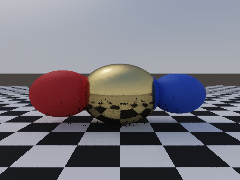

*Three spheres — diffuse red, gold metal (GGX), blue — on a checker floor. Rendered by `render_auto` at
`quality="high"`; the adaptive sampler spent ~31 mean / 64 max samples per pixel across 8 passes, concentrating
on the metal and the checker reflections.*

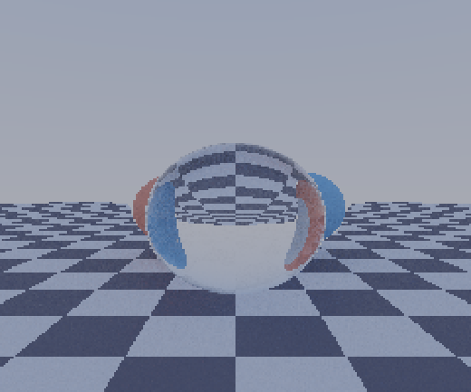

*A clear **glass** sphere in front of coloured spheres. The material returns an index of refraction (IOR 1.5), so
the tracer bends rays through it; **chromatic dispersion** splits white light into a coloured fringe (red, green
and blue traced with slightly different IOR — blue bends most, the Cauchy relation); and a real **caustic** —
light forward-traced *through* the sphere and splatted where it focuses (`holographic_globalillum.caustics`) —
brightens the floor beneath it. A forward path tracer can't find caustic paths inline, so the focused light is
brought to the floor separately, then composited before tone-mapping.*

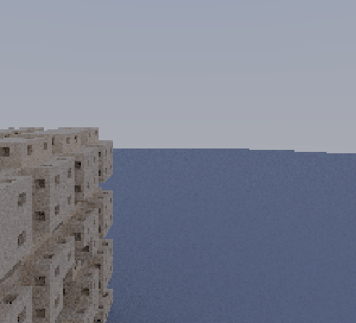

*A **Menger sponge** (3 recursion levels) ray-marched from its signed-distance function. The geometry is
*generated*, not stored — the SDF is a few bytes whether it resolves to 100 k or 250 k faces.*

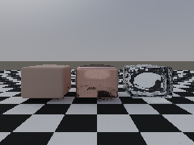

*One surface, **three identities**. The *same* rounded shape is rendered three times as matte clay, polished
copper, and clear glass — and each is a **physical material pulled from the library** (`holographic_matlib`), so
the renderer reads the metallic / roughness / IOR straight off the material rather than from hand-typed numbers.
The engine carries a surface as one field, and a "material" is just a different physical read of it.*

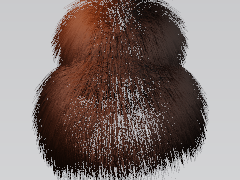

*Fur, shaded by a **physical fiber material** (`holographic_matlib`'s `fur_ginger` → a Marschner strand BSDF: the
colour drives absorption, the roughness/cuticle-tilt set the R/TT/TRT lobes). Groom grows strands straight out
along the surface normal, so the coat is then **combed** — each strand bent from its normal toward a flow
direction so it lies along the body and flows, instead of standing on end. Rendered at 2× and box-downsampled
(**supersampled anti-aliasing**, since strands rasterise as 1-px lines), and lit with a **key** light (reveals
the groomed form) plus a softer warm **rim** from behind (the translucent fur edges glow). A normal-based surface
shader can't do this — hair scatters around its tangent, not a surface normal.*

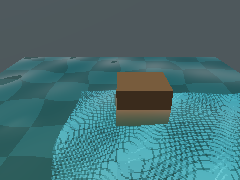

*An **ocean in a box, with buoyancy**, rendered with a dedicated **water shader** (an open water surface over a
floor doesn't fit the path tracer's closed-object glass model — which is why the earlier version went black).
Where a camera ray meets the rippled surface, **Fresnel** splits it into a reflection of the sky and a
**refraction** down into the water; the refracted ray is marched to the sandy floor and faded by **Beer-Lambert
absorption** over the underwater distance — water absorbs red first, so deep water reads blue and dark (the
volumetric depth). **Pool caustics** (`holographic_globalillum.caustics`) brighten the sand, and a wooden cube
floats at its **Archimedes waterline** (submerged fraction = density ratio ≈ 0.6).*

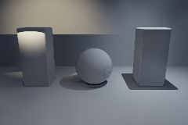

*__The full light rig__ — the complete set of placed lights a real DCC app has, all sampled by next-event estimation so all cast correct shadows. Three pillars and a sphere against a backdrop, lit by: a __spot with a gobo__ (a striped light cookie projected across its cone, left, warm), a soft __rect area light__ (a softbox, middle), and an __IES downlight__ (a real luminaire's measured beam shape, right, cool). Beyond these there are also point, directional, ambient, sphere, and mesh (emissive-geometry) lights, and every light's colour or intensity can be a __field__ that varies across the scene. `load_ies()` reads a real .ies photometric file.*

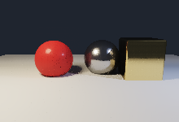

*__Placed lights + next-event estimation__ — a scene lit by real lamps you put in the world, with correct shadows, instead of only a big sky. The path tracer used to gather light only when a bounce ray happened to escape and hit the emissive environment, so a small bright lamp was almost never found — hopeless noise. Next-event estimation points a shadow ray __straight at each light__ and adds its contribution directly, so lamps converge instantly. Here a warm sphere light (its area gives __soft__ shadows) and a cool point light from the other side light three objects in a dark room. The random bounce still runs, so indirect light — colour bleeding, ambient fill — isn't lost.*

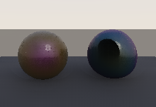

*__Thin-film iridescence__ — the rainbow sheen of a soap bubble or oil slick, from real interference physics. A thin transparent film reflects light off both its top and bottom surfaces; the two beams interfere, and whether a colour reinforces or cancels depends on the film thickness __and the view angle__ — so the hue sweeps across a curved surface and shifts as it tilts. Left: a soap bubble (~300 nm film). Right: an oil-slick sphere (~440 nm). The colour is computed from two-beam interference and integrated against the eye's CIE response (reused from the blackbody code), then the path tracer tints the reflection by angle. It comes from the material's film thickness, not a painted texture.*

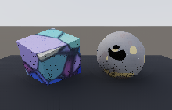

*__Physical-structure materials__ — the colour comes from the material's internal __structure__, sampled at each point, not a flat swatch. Left: a __polycrystalline gem__ — a Voronoi grain partition where every facet is a slightly different colour, darkened along the grain boundaries. Right: an __ore boulder__ — a base rock shot through with impurity __inclusions__ (metallic pockets at a calibrated coverage, the planet's ore-deposit pattern scoped to a material). Both are albedo sockets `f(points)→rgb` carried on the scene object; the renderer samples them per hit.*

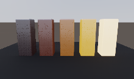

*__Thermal emission__ — a material glows because it is __hot__, and the colour of the glow is set by its temperature (Planck's law / blackbody radiation): dull red near 700 K, orange by ~1400 K, yellow-white past ~2500 K. Left to right the same iron bars are heated to increasing temperatures, so the blackbody ramp reads as a row. The emission is __derived__ from the material's temperature (`matlib.heat` + `holographic_blackbody`), not a hand-picked colour — a physical property driving the render.*

*__Realistic volumetric cloud__ — a fluffy cumulus from `mind.make_cloud()` / `build_scene("a fluffy cloud")`. The shape is a smooth-union of many fBm-eroded lobes with a flat base (`holographic_semantic.cloud_field`); the look comes from physically-motivated volume lighting (`holographic_render.volume_render`): single-scatter self-shadowing for the bright sunlit crown and sky-blue shadowed base, a Henyey-Greenstein forward lobe for the silver-lining glow, a Beer-Powder term for roundness, and a cheap multi-scatter approximation so the shadows never go black. The fBm density bakes with the exact vectorised `sample_grid_fast` (~40x faster than the per-point path). See `RENDERING_GUIDE.md`.*

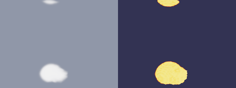

*Smoke (left) and **fire** (right) from **one** 3-D Stable-Fluids simulation, rendered volumetrically. A heated plume is simulated on a voxel grid, then a trilinear sampler exposes that grid as the callable density field the volume ray-marcher (`holographic_render.volume_render`) marches: the smoke pass reads it as grey absorption, the fire pass reads the hot (density×temperature) core through a blackbody emission ramp. Both pieces existed; this is the first time the solver and the volume renderer were pointed at each other for a picture.*

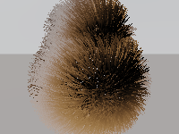

*__Hair as a pipeline stage__ — a groomed coat composited over a __path-traced__ body by the render pipeline, not by the hair renderer alone. The body is ray-traced with a library skin material; the pipeline's hair stage then renders the strands (Marschner fiber shading, the look driven by a fur material's physical parameters) __with a coverage alpha__ and over-composites them, so the fur sits on a properly shaded, shadowed body. The strand renderer already existed — the alpha is what lets it be a layer in the frame.*

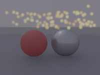

*__Particles as a pipeline stage__ — a swarm of glowing ember sparks composited over the scene by the render __pipeline__. The particle system simulates the points (a buoyant drift advanced by the shared symplectic integrator); the pipeline's particle stage projects each point through the camera and splats it as a soft round dot, over-compositing onto the surface render. Nearer sparks cover farther ones and a depth fade dims the ones drifting to the back. The simulator already existed — this is the missing renderer that turns its points into a picture.*

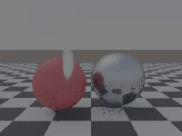

*__Volume as a pipeline stage__ — a smoke plume rising behind two spheres, composited over the solid scene by the render __pipeline__, not hand-composited in the demo. A little 3-D smoke sim is handed to the pipeline as part of the scene; the pipeline renders the surfaces, then its volume stage marches the smoke density and over-composites it (`out = volume + surface·(1−alpha)`). This is the difference between "the volume renderer exists" and "a scene with a volume renders as one frame."*

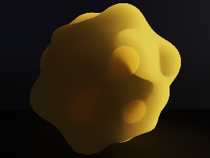

*__Subsurface scattering__ — a translucent material glows where it is __thin__. One big blob of __honey__ (an orange translucent from the library) fills the frame in a near-black room, lit by a single light behind and to the side; its displaced (bumpy) surface varies in thickness, so the thin bumps on the lit side glow bright orange while the thick body absorbs toward black. The path tracer measures how much solid the light crosses inside the object toward the light (`holographic_raymarch.subsurface` — Beer-Lambert on the SDF interior) and adds that as the glow; the colour is the material's own. Fixed exposure on purpose: auto-exposure would lift the dark room to mid-grey and wash out exactly this contrast.*

> **How these are rendered — and an honest benchmark.** The old gallery called the raw path tracer at a fixed> sample count, so it was grainy in the hard spots (glass, reflections) and wasteful in the easy ones (flat sky).
> `render_auto` fixes the *wiring*: it converges each pixel to a quality target and denoises by the measured
> variance. Measured on the spheres scene against a 128-spp reference (PSNR in tonemap space — where visible
> grain lives): at equal average sample budget the auto path **beats** a raw trace at draft/medium quality
> (e.g. +2.4 dB at ~10 spp, +0.8 dB at ~19 spp), and **ties** it near convergence at high quality — because once
> a pixel is already converged, denoising it can only soften detail (a documented crossover, kept loud). The win
> is that this happens with *no per-scene tuning*: the same call calibrates spheres, glass, a fractal, and a
> water tank alike.

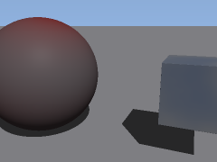

*The **composability** stack, made visual — a different path from the tracer above. A texture is built as a small
graph of operations (`mind.texture_op("mix", a=red, b=cyan, t=fbm_noise)`), a scene is described in words
(`mind.build_scene("a big sphere and a small box")`), the graphs are painted on (`scene.paint(...)`), and
`scene.render()` routes through `render_textured`: it marches the SDF, turns each surface hit into a UV
coordinate (spherical on the sphere, planar on the box), samples the composed texture there, and shades it with
the same Cook-Torrance BRDF plus a light and a hard shadow. The pattern genuinely **wraps** the geometry via UV
mapping — it isn't a flat recolour. (Honest: textbook UV, so a seam and a pole pinch on the sphere; one hard
light — the path tracer above is the tool for soft GI.)*

---

## Procedural & generative

Richness from a tiny deterministic kernel.

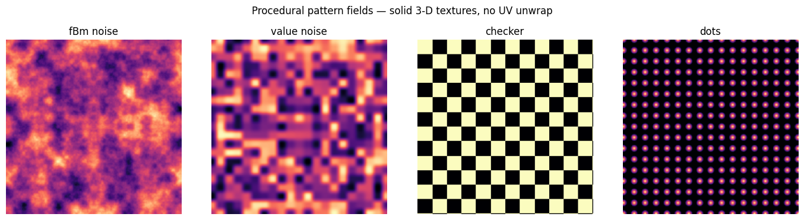

*Procedural pattern fields (`holographic_pattern`): fBm, value noise, checker, dots — each a **field over world
position**, a solid 3-D texture that wraps any surface with no UV unwrap.*

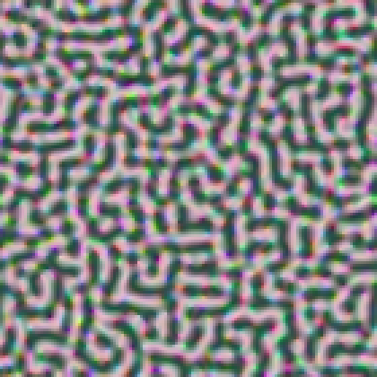

*A vector-valued reaction–diffusion cellular automaton (`holographic_automaton`) — Turing patterns in hypervector
space, 24 steps, projected to RGB.*

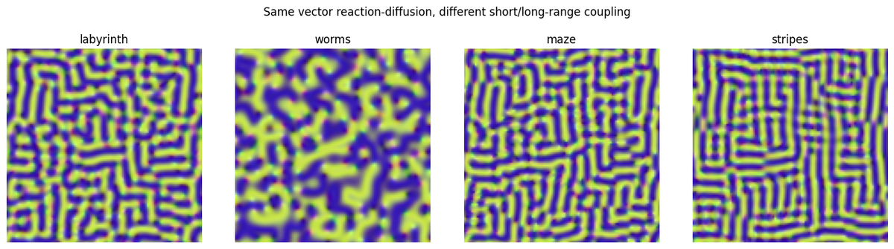

*The same machinery under different couplings — from the test suite.*

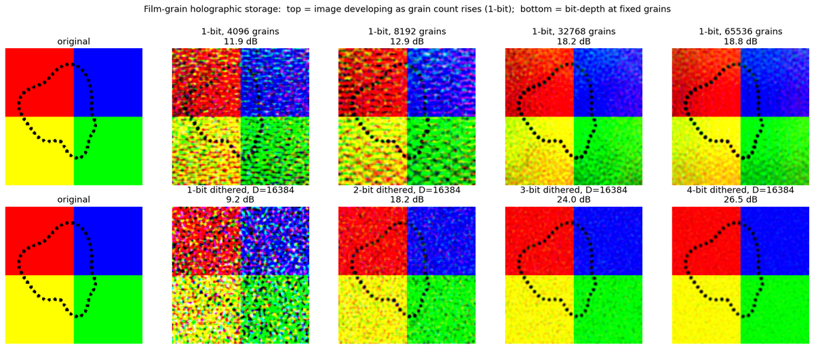

*Image-processing output from the test suite.*

---

## Content-addressable memory & superposition

Store many things in one space; recall by content; degrade gracefully instead of failing hard.

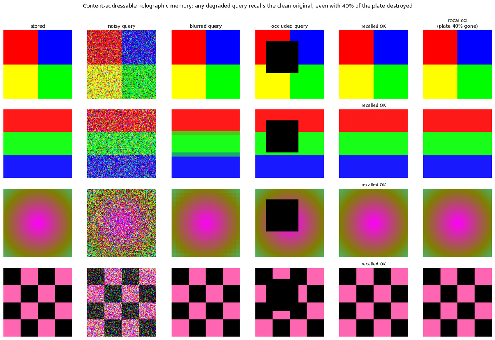

*The holographic image archive (`holographic_archive`): images superposed into Walsh–Hadamard key plates and any
one recovered by content — exact when undamaged, graceful under an erasure mask.*

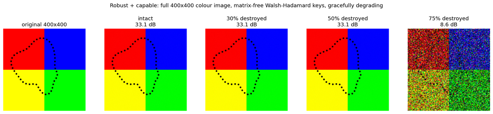

*Reconstruction quality across stored images — recovered beside original, from the test harness.*

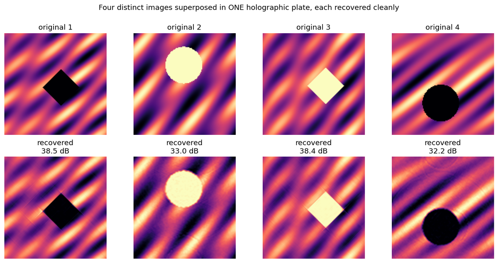

*Many signals bundled into one hypervector and pulled back apart by content — superposition as storage.*

---

## The deterministic learning creature

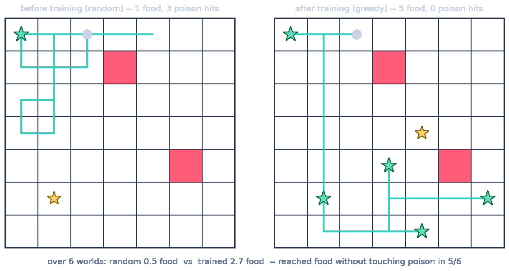

*The reinforcement-learning forager (`holographic_creature`) — deterministic, debuggable, learns online without
catastrophic forgetting, and can say in human sense-terms why it chose a move.*

---

## Data & measured behaviour (the non-3-D story)

How the algebra actually behaves — every claim with a baseline and a spread. These four are generated fresh.

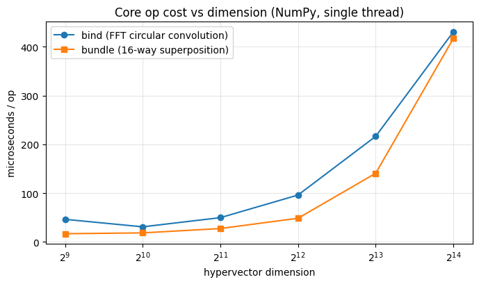

*Cost of the two core operations vs hypervector dimension — `bind` (FFT circular convolution) and a 16-way
`bundle` (superposition), microseconds per op, single thread. The whole algebra is cheap.*

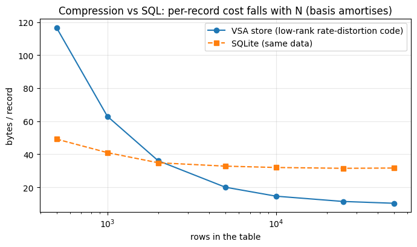

*The measured answer to "how well does our store compress vs SQL?" — bytes/record for the engine's low-rank
rate-distortion code vs SQLite on the same structured data, as the table grows. The VSA store's shared basis
**amortises**, so per-record cost **falls with N** and crosses *under* SQLite at a few thousand rows (~10 vs
~32 B/record by 50 k). gzip beats both on raw bytes, but gives no query — the VSA bytes *are* the fuzzy index.*

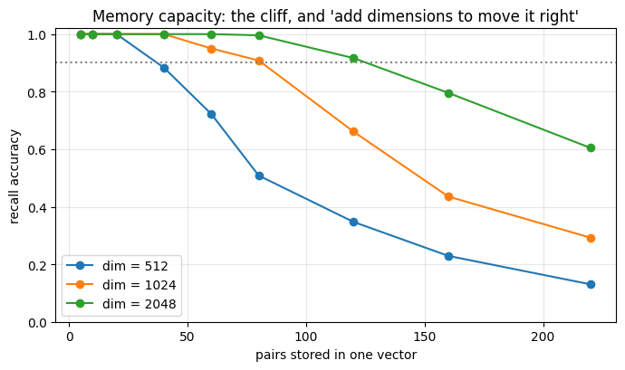

*Key→value recall accuracy vs how many pairs are packed into one vector, at three dimensions. The honest capacity
**cliff** — and how adding dimensions moves it to the right (capacity ≈ order D).*

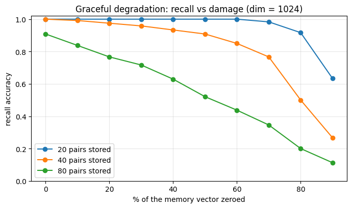

*Recall accuracy as the memory vector is progressively zeroed out. It declines **gracefully** rather than
crashing — the hallmark of distributed/holographic storage.*

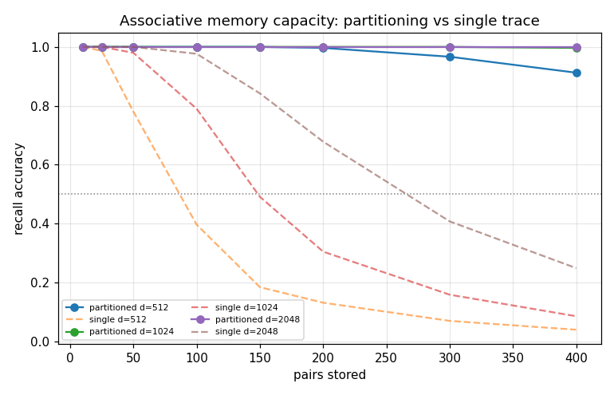
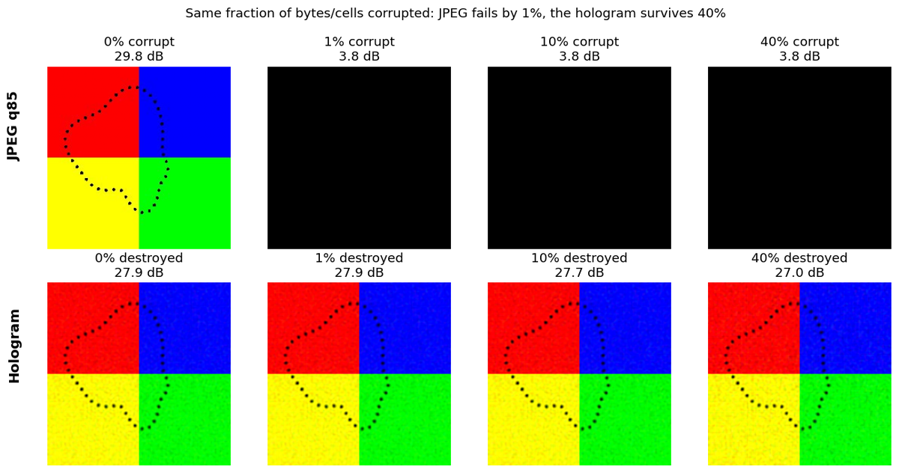
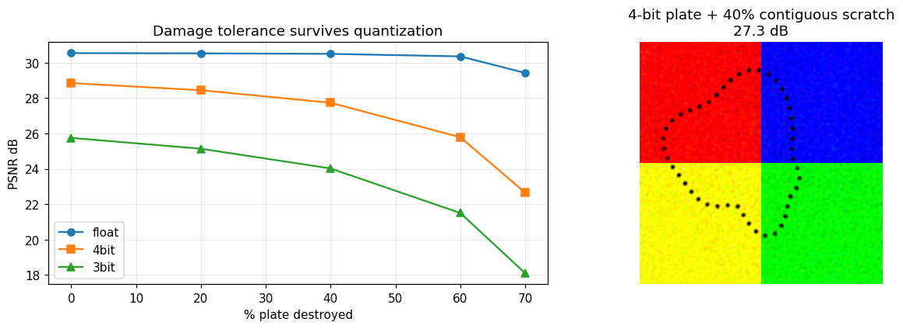
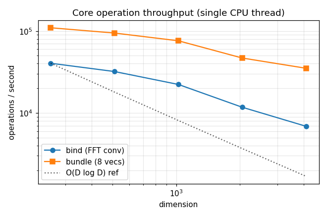
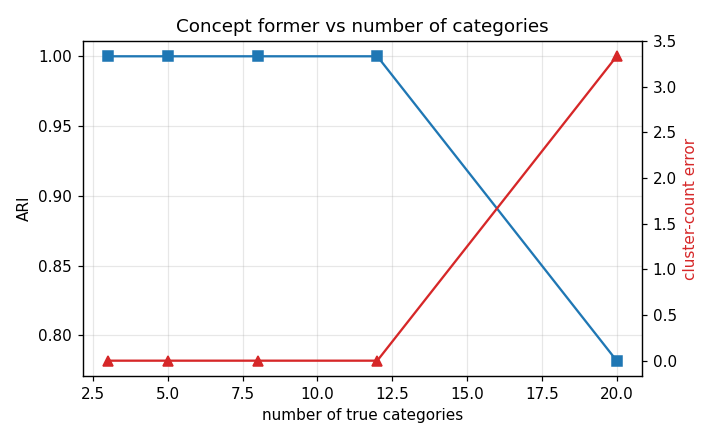
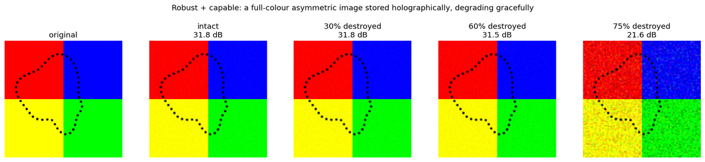

*More measured curves from the benchmark/stress harness — capacity, corruption tolerance, quantization
robustness, throughput, adversarial scaling, and a before/after ablation. Every gain is measured against a proper
baseline.*

---

*The 3-D renders, procedural patterns, reaction–diffusion frame, and the four data charts regenerate any time
with `python make_gallery.py`; the rest are produced by the test suite and benchmark harness.*
