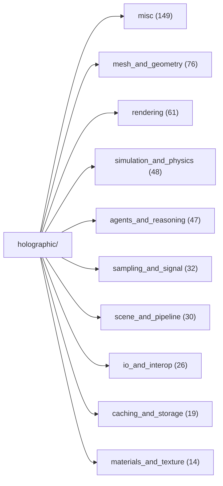
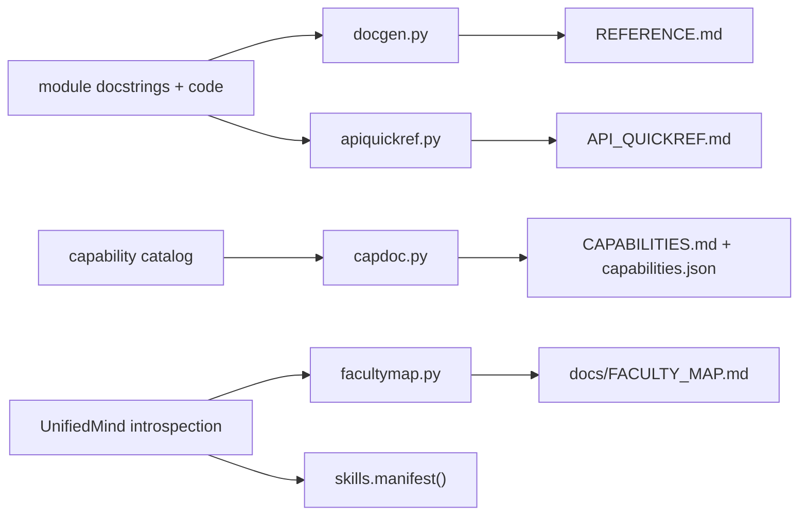

# Documentation map -- which doc answers which question

*Generated by `docmap.py`; regenerate it whenever a doc generator is added. This page exists because the doc generators themselves were once undiscoverable (see the script's docstring).*

| The question you have | Open / run | Generator | Scope |
|---|---|---|---|
| Read the WHOLE engine, module by module | `REFERENCE.md` | `docgen.py` | every holographic_* module: its why-docstring, public classes and functions |
| I have a JOB to do -- which capability, and what do I type? | `CAPABILITIES.md` | `capdoc.py` | the curated capability catalog, grouped, with runnable examples (machine twin: capabilities.json) |
| What can the APP-BUILDING surface do (scene, mesh, camera, render)? | `API_QUICKREF.md` | `apiquickref.py` | one line per public symbol of a short curated module list |
| What can the MIND do, by topic (mesh_*, render_*, file_* ...)? | `docs/FACULTY_MAP.md` | `facultymap.py` | all UnifiedMind public methods, prefix-clustered, one-line docs (live introspection) |
| Machine-readable cards for agents (act/choose routing, autocomplete) | `(in-memory)` | `holographic_skills.manifest()` | capability + method cards as data; not a file on disk |
| Is the tree still ORGANIZED (misc budget, giants, section markers)? | `(report)` | `tools/structure_audit.py` | budgeted-baseline structural gates; fails only on regression |

Regenerate the generated set in one go (the close-out ritual):

```sh
python3 capdoc.py && python3 docgen.py && python3 apiquickref.py && python3 facultymap.py && python3 docmap.py
```

## Family layout (502 modules)



## Doc pipeline


